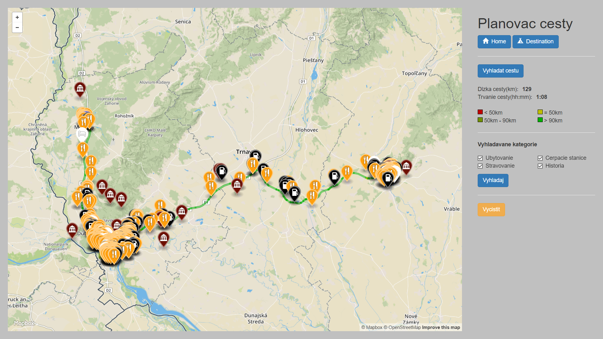

# Overview

Aplikacia vypocita a zobrazi najkratsiu cestu medzi zadanymi bodmi a zobrazi sluzby nachadzajuce sa popri ceste. Najdolezitejsie funkcie su:
- Najdenie najkratsej trasy medzi dvoma zvolenymi bodmi
- Zobrazovanie sluzieb nachadzajucich sa pozdlz cesty
- Filtrovanie zobrazenych sluzieb podla kategorii(ubytovanie, stravovanie, cerpacie stanice, kulturne pamiatky)

Aplikacia vyzera nasledovne:



Aplikacia je zlozena z backendu a frontendu. Frontend je webova aplikacia vyuzivajuca kniznicu mapbox. Backend bezi na [node.js](https://nodejs.org/en/), ktory je napojeny na Postgres databazu. Frontend komunikuje s backendom pomocou jednoducheho [REST API](#api).


# Frontend

Frontend sa sklada z jedinej stranky(`stranka.html`). Obsluzny skript pre stranku sa nachadza v `stranka.js`. Funkcie vyuzivajuce REST API sa nachadzaju v `requests.js`. Frontend plni nasledovne ulohy:
- Zobrazuje mapu
- Zobrazuje bocny panel s kontrolnymi prvkami a moznostami filtrovania
- Zobrazuje ziskane data z backendu


# Backend

Backend sluzi na spracovanie dat ziskanych dopytovanim databazy a ich posielanie na frontend.


## Data

Do databazy boli importovane data o celom slovensku. Ich velkost v nekomprimovanej forme dosahovala priblizne 4.17GB. Na dekomprimaciu obsahu bolo pouzite `osmconvert64`, na import `osm2pgsql` a na vytvorenie dodatocnych tabuliek pre pgRouting osm2pgrouting. GeoJSON je vytvarany standardnym prikazom sT_AsGeoJSON. Queries a spracovanie dopytov sa nachadza v `dbhandlers.js`.

## Api

**Najdi cestu medzi dvoma bodmi**

`POST /findpath`

telo spravy obsahuje JSON v ktorom su ulozene suradnice danych bodov.

**Najdi zariadenia pozdlz najdenej cesty**

`POST /finditems`

telo spravy:
```
{
  checkboxes: Array[4]
  finish: Array[2]
  length: 127
  path: Array[440]
  start: Array[2]
}
```

### Response

Backend odosiela naspat JSON poskladany na zaklade zadanych filtrov. Pre najdenie zariadeni tak vrati JSON s 1 az 4 klucmi reprezentujucimi kategoriu. Vnutri nich su zoznamy najdenych zariadeni obsahujucich meno zariadenia a GeoJSON.

Pri vyhladani cesty vracia zoznam jednotlivych usekov, ku kazdemu, jeho dlzku, maximalnu rychlost a cas, za ktory je mozne ju prejst v idealnych podmienkach. Okrem toho obsahuje aj geoJSON.
```
{
  pump: Array[68],
  sleep: Array[36]
}

{
  elapsed_time: 0.000935134716848319,
  geojson: "{"type":"LineString","coordinates":[[17.1177382,48.1203998],[17.1180742,48.120514]]}",
  length: 0.0280540415054496,
  maxspeed_forward: 30
}
```
